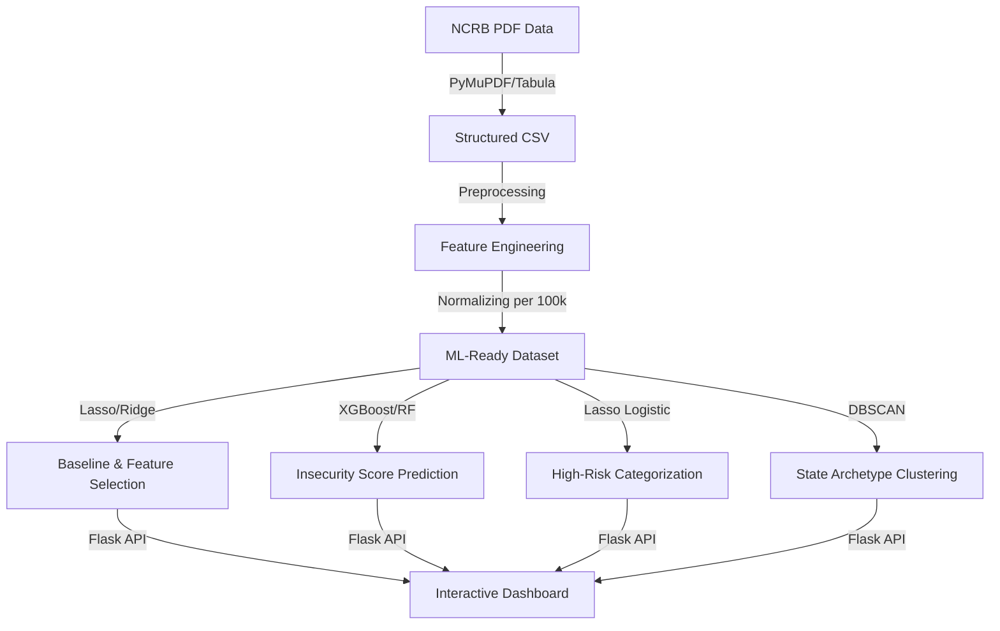

# Walkthrough: Final ML Pipeline Documentation

I have created a comprehensive, professional documentation suite for your **Project CrimeScape**. This documentation is designed to tie together your data extraction, EDA, ML models, and dashboard into a single cohesive narrative suitable for a viva, presentation, or final project report.

## 📄 Key Documentation Created

### 1. [ML Pipeline Explanation](file:///d:/College/Projects/PRJ-3/Crimes/Analysis/ml_pipeline_explanation.md)
This is your **Main Technical Document**. It structures the entire system and provides:
- **Hierarchical Taxonomy**: Defines the role of each model from baseline (Linear/Lasso) to advanced ensembles (XGBoost) and clustering (DBSCAN).
- **Direct Linkage to EDA**: Explains how normalization and correlation analysis informed your model design.
- **Decision Logic**: Justifies why multiple models were used (Interpretability vs. Accuracy).
- **Standardized Outputs**: Defines exactly what "Insecurity Score" and "Risk Grade" mean for a law enforcement user.

### 2. [Viva Cheat Sheet](file:///d:/College/Projects/PRJ-3/Crimes/Analysis/viva_cheat_sheet.md)
This is a **Quick Reference Guide** designed for your presentation or viva. It includes:
- **Top 5 Probing Questions**: Detailed answers to common questions about XGBoost, DBSCAN, and Normalization.
- **Model 'In-A-Nutshell'**: Simple, real-world analogies for each model to help you explain them clearly to a non-technical audience.
- **Technical Metrics Corner**: A summary of key metrics (R-squared, Silhouette, CV) that you might be asked to define.

## 🛠️ ML System Architecture Recap

The diagram below summarizes the workflow integrated into these documents:

## ✅ Final Goals Achieved
- [x] **Defined Roles**: Linear (Baseline), XGBoost (Prediction), Logistic (Classification), DBSCAN (Clustering).
- [x] **Standardized Outputs**: Insecurity Score, Risk Label, Cluster Group.
- [x] **Justified Choices**: Ensembles for non-linear patterns, Lasso for redundancy management.
- [x] **EDA Integration**: Normalization (Per 100k) and Volatility (CV) linked to model inputs.
- [x] **Viva Ready**: Simple explanations and real-world interpretations provided.

> [!TIP]
> Use the **Viva Cheat Sheet** during your rehearsal to practice explaining "Why DBSCAN?" and "Why Normalization?". These are the most common technical questions for this type of project.

---
*Documentation suite completed successfully.*
